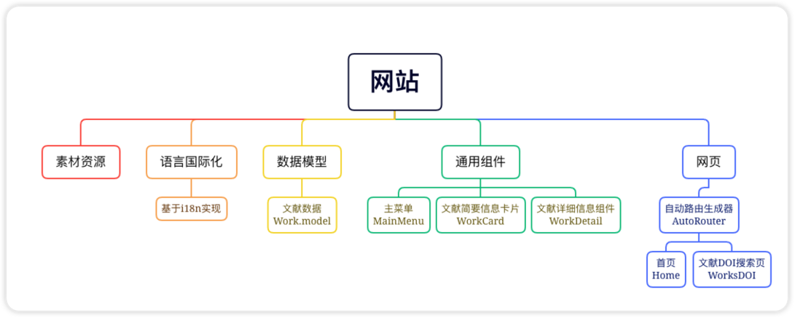
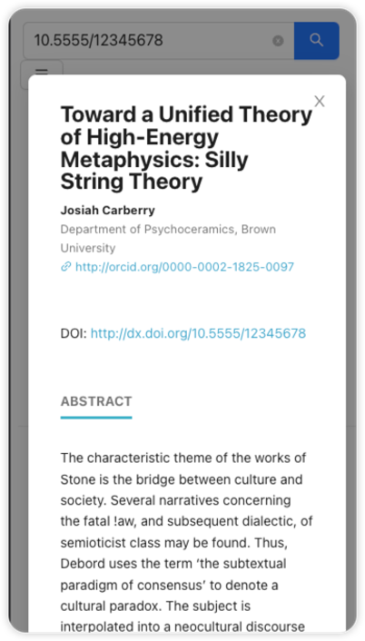

# 科学引文信息展示应用说明文档

## 背景
Digital Object Identifier (DOI) 是一种用于识别和引用学术论文、期刊文章和其他科学出版物的数字标识符。对于科学研究和学术交流而言，DOI能够确保文献的持久性和可访问性。

## 目标
设计和构建一个应用程序，可接收用户输入的 DOI 信息，并通过调用公开数据 API，获取科学引文的详细信息并进行展示。

## 框架工具选择
1.	技术选型：选择 React 框架作为主要开发工具，通过虚拟 DOM 的高效性能和组件化的开发方式，提供良好的开发体验和界面交互响应性。
2.	状态管理：使用 React-Hooks 自带的State作为状态管理工具。
3.	UI 设计：采用现代化的响应式布局，使用 AntDesign UI 组件库来提供一致且美观的用户界面。借助 AntDesign UI 的组件和风格，能够快速搭建用户界面，并提供可重用的组件。
4.	性能优化：借助 React 框架的虚拟 DOM 和渲染机制，有效地减少不必要的 DOM 操作和页面重绘，以提高应用程序的性能和用户体验。
5.	单元测试：使用 Jest 和 React-Testing-Library等测试框架编写单元测试，确保项目中重要功能的正确性和代码质量，保证代码的健壮性和可维护性。
6.	工程化实践：采用模块化的方式组织代码，将代码分割成可复用的组件和功能模块。

## 架构设计
题目本身要完成的功能相对简单，开发一个页面就足以完成，但是从工程的角度来看，这是以一生多的扩散性题目。
1. 网站的潜在用户是全球性的，架构设计中加入了主流的国际化组件库i18n。
2. 通过了解公开的API文档，发现文献数据较为复杂，可以通过数据模型化的方式来对数据进行归整（本项目代码中只对顶层数据进行了模型化），以便提高可读性和开发效率。
3. 如果作为一个完整的项目网站，一般情况下会有多处页面对用户的搜索结果进行展示，于是这里设计两个通用组件简要信息卡片(WorkCard)和详细信息组件(WorkDetail)，以便后续的开发进行多处复用。
4. 如果作为一个完整的项目网站，必然会存在多个页面，这就涉及到页面路由的维护问题。为了方便管理与提升效率，这里用一个“自动路由生成器”将指定位置的目录（含子目录）自动解析成网页路径并注册到路由中。

图表1. 架构设计图 

图表2. 代码结构图 

## UI设计与说明
UI的实现借助于AntDesign组件库（支付宝风格）来完成。布局设计为响应式布局，将可视宽度760px作为大屏幕与小屏幕的区分线。
1. 首页的背景图采用了细胞发散的设计，让首页看起来更有科学感。首页由一行文字和一个搜索框组成，文字用于说明本网站的用途。在大小屏幕切换时，文字的字体大小会自动切换不同的字号。首页在布局上主要以搜索框为首重点，所以搜索框的位置尽可能摆在屏屏幕的正中间。

图表3. 首页大屏幕效果图 

图表4. 首页小屏幕效果图 

2. 搜索结果页，如图表5，分为三个区域。区域1为菜单栏，可以提供跳转其他功能的能力；区域2为搜索区，可以提供给用户搜索其他文献的操作；区域3为结果列表区，这里展示文献的简要信息。当生于小屏幕的情况下，菜单栏会折叠起来，变成悬浮的按钮，如图表6。

图表5. 搜索结果页大屏幕效果图 

图表6. 搜索结果页小屏幕效果图 

3. 文献详细页，因为列表可能会有很多项搜索结果，而且每一份文件都已经有外链可以跳转去文献的源网页，所以为了提高用户的操作简易性，点击图表5中的”View Detail”会弹框显示文献的详细页（公开API能获取到的）。

图表7. 文献详情的大屏幕效果图 

图表8. 搜索结果页小屏幕效果图 

